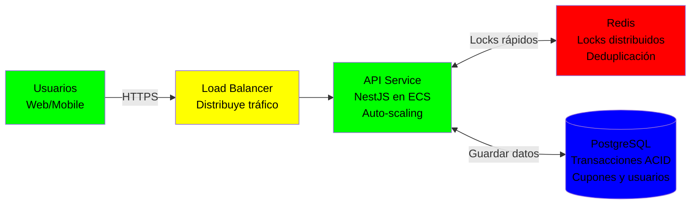
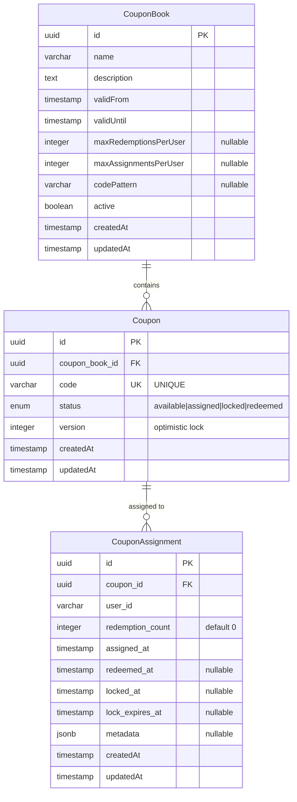
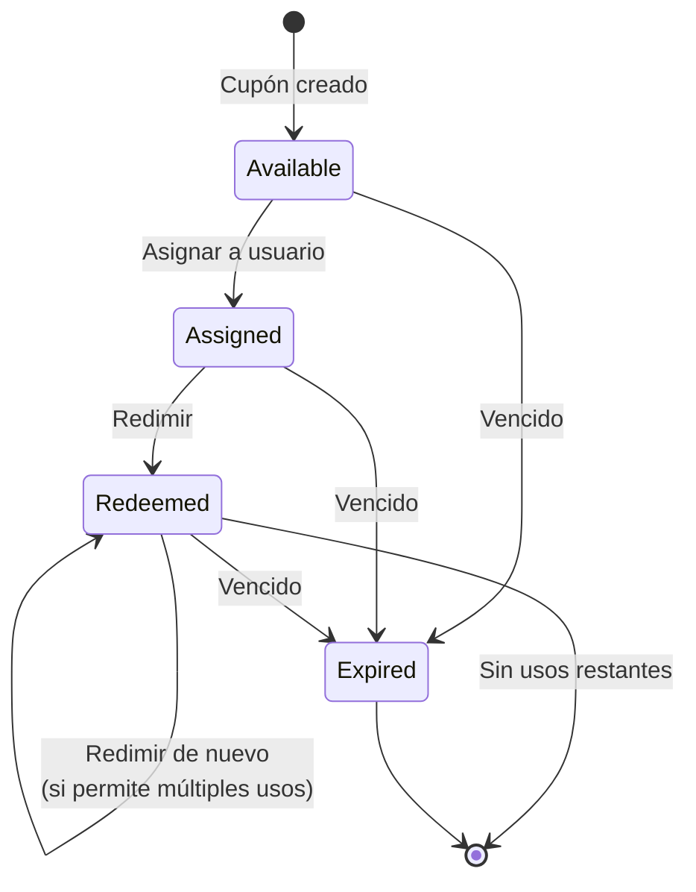
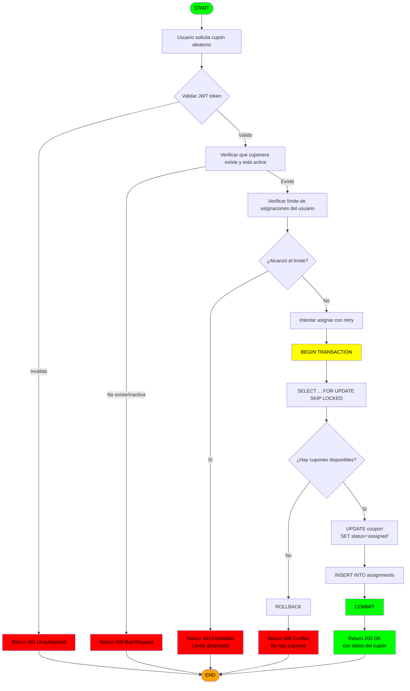
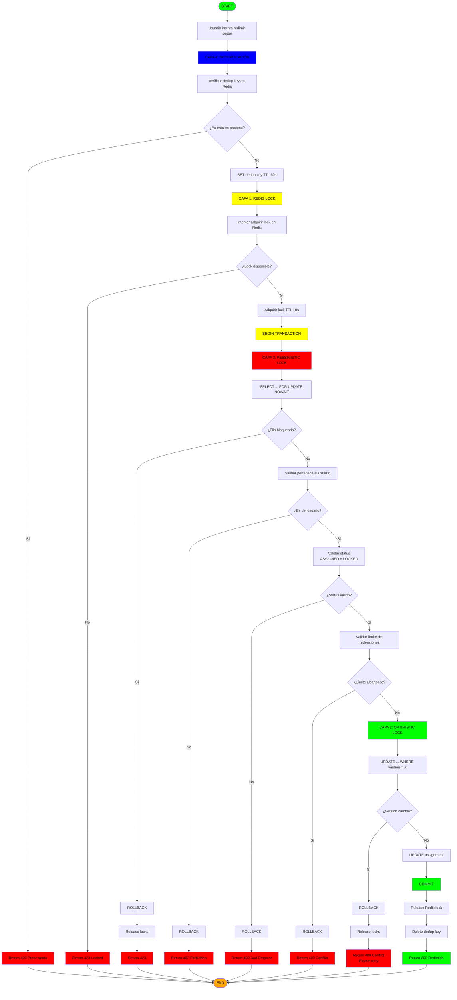
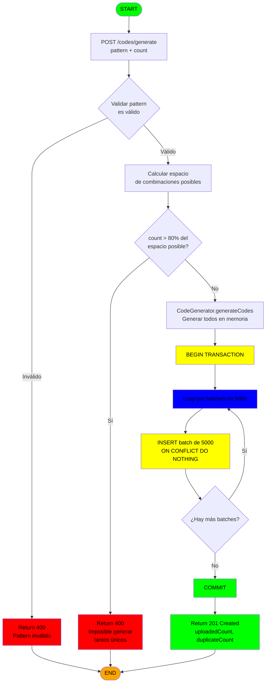
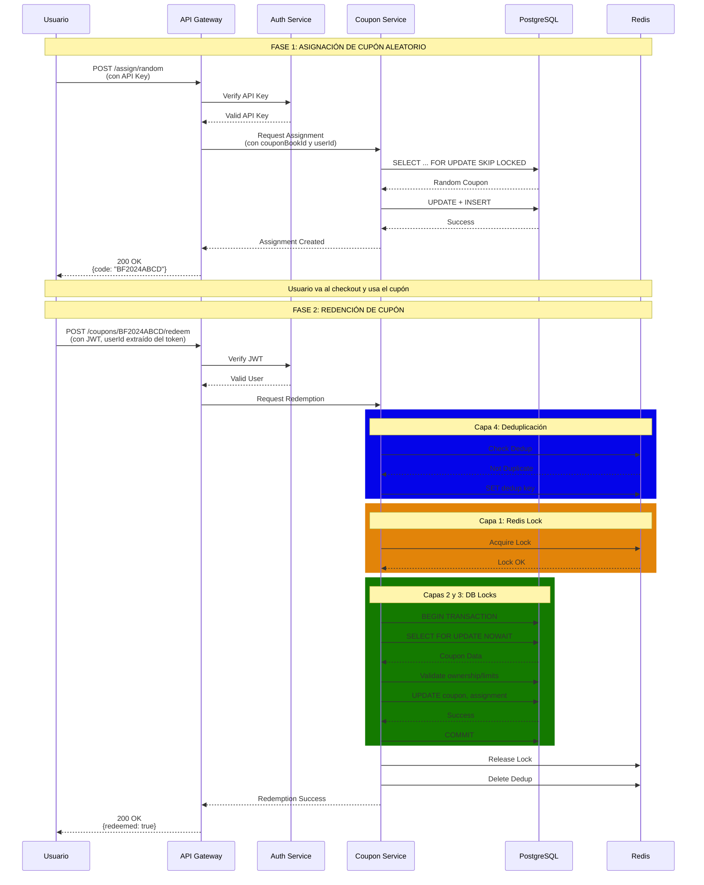
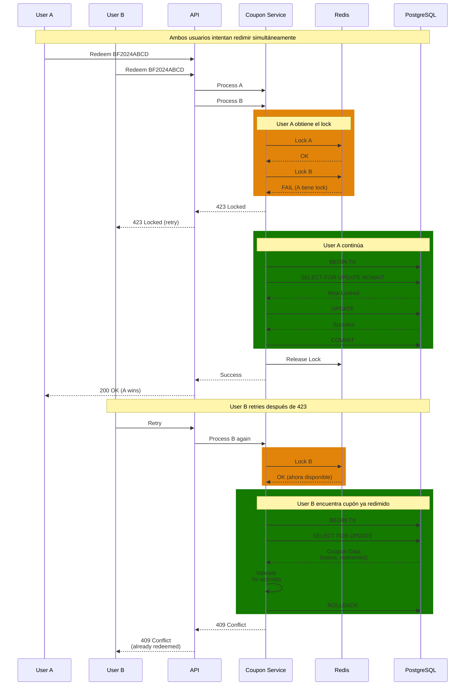
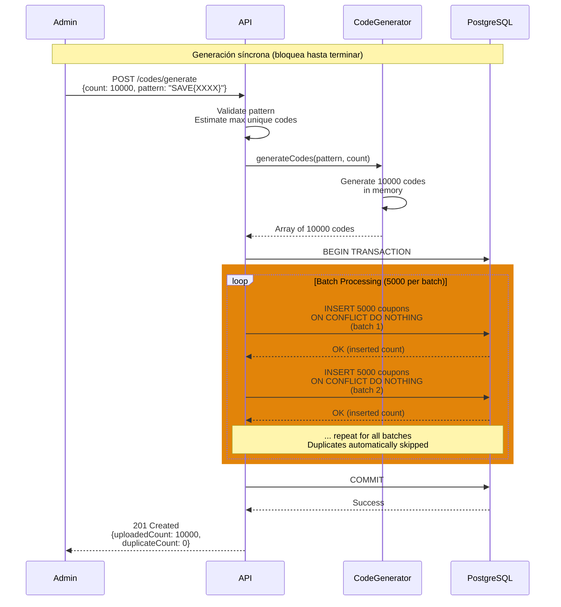

# 🎟️ Sistema de Cupones - Diseño Técnico

**Autor:** Cucchi Santiago  
**Fecha:** Noviembre 2024

---

## 🎯 El Problema

El challenge pide diseñar un sistema de cupones. Parece simple al principio, pero tiene complejidad real cuando lo pensás en profundidad.

### Los Tres Problemas Que Identifiqué

**1. Concurrencia**

Si 1000 personas intentan usar el mismo cupón al mismo tiempo, ¿cómo garantizo que solo una lo consiga? No es solo poner un lock, porque locks pueden fallar, hay retries, double-clicks, network issues.

**2. Asignación Aleatoria**

Tengo millones de cupones. Necesito darle uno random a un usuario. Si hago `SELECT * ORDER BY RANDOM()` sobre 10 millones de filas, tarda segundos. Y si 1000 usuarios lo hacen simultáneamente, explota.

**3. Generación de Códigos**

Generar 100k códigos únicos con patrón `SUMMER{XXXX}` suena simple, pero:
- Pueden haber colisiones
- Validar unicidad cada vez es lento
- Deben ser impredecibles (seguridad)

---

## 🏗️ Decisiones de Arquitectura

### Stack: NestJS + PostgreSQL + Redis

**NestJS** porque:
- TypeScript (me gusta tener types)
- Estructura clara con módulos
- Swagger integrado (documentación gratis)
- Comunidad sólida y herramientas (evita reinventar la rueda)

**PostgreSQL** porque:
- Necesito transacciones ACID (cupones = dinero)
- Tiene `FOR UPDATE SKIP LOCKED` que es perfecto para mi caso
- Sé hacer queries complejas
- Las relaciones son claras (books → coupons → assignments)

**Redis** porque:
- Locks distribuidos super rápidos
- TTL automático (no quedan locks huérfanos)
- Deduplicación simple

### ¿Por Qué No NoSQL?

Lo consideré. MongoDB o DynamoDB podrían funcionar, pero:
- No tienen transacciones robustas como PostgreSQL
- Locks son más complicados de implementar
- Para este caso específico, SQL es mejor

No es que NoSQL sea malo, solo que para cupones, SQL tiene ventajas claras.

### Deployment: AWS ECS Fargate

Elegí AWS con ECS Fargate por simplicidad. Podría usar Kubernetes (EKS), pero para este proyecto es overkill. Fargate me deja deployar containers sin gestionar servidores y enfocarme en resolver el problema de concurrencia que es lo interesante.

Si necesitara Kubernetes después, el código es portable (está en Docker).

### Diagrama de Arquitectura del Sistema



**Componentes principales:**

1. **Load Balancer**: Reparte las peticiones entre varios servidores API para aguantar mucho tráfico
2. **API Service (NestJS)**: El backend que maneja todas las operaciones de cupones
3. **Redis**: Memoria súper rápida para los locks (evita que dos personas usen el mismo cupón)
4. **PostgreSQL**: Base de datos donde se guardan los cupones, usuarios, etc

**Flujo simple:**
- Usuario pide un cupón → Load Balancer → API
- API chequea Redis (¿está libre?) → Guarda en PostgreSQL
- Para generar muchos códigos (>50k), el proceso se hace asíncrono en background

---

## 💾 Base de Datos

### Modelo

Tres tablas principales:

```
CouponBook
  - id
  - name
  - validFrom, validUntil
  - maxRedemptionsPerUser (null = ilimitado)
  - maxAssignmentsPerUser (null = ilimitado)
  - codePattern
  
Coupon
  - id
  - coupon_book_id
  - code (único)
  - status (available, assigned, locked, redeemed)
  - version (para optimistic locking)
  
CouponAssignment
  - id
  - coupon_id
  - user_id
  - redemption_count
  - assigned_at
  - redeemed_at
  - locked_at, lock_expires_at
```

### Diagrama de Entidad-Relación



**Relaciones:**
- Un `CouponBook` contiene muchos `Coupon` (1:N)
- Un `Coupon` puede tener múltiples `CouponAssignment` si permite redenciones múltiples (1:N)
- La combinación `(coupon_id, user_id)` es única en `CouponAssignment`

### Diagrama de Estados del Cupón



**Estados:**
- **Available**: Disponible para asignar
- **Assigned**: Asignado a un usuario, listo para usar
- **Redeemed**: Ya usado (puede volver a usarse si `maxRedemptions > 1`)
- **Expired**: Venció por fecha

**Nota:** El estado `locked` (durante checkout) es temporal y se maneja con timestamps en la tabla, no como estado persistido.

### ¿Por Qué Tabla Separada para Assignments?

Podría poner `user_id` directamente en `Coupon`, pero así no puedo:
- Soportar múltiples redenciones por usuario
- Guardar metadata por cada redención
- Tener historial completo

Con tabla separada, todo eso es posible.

### Índices Importantes

```sql
-- Búsqueda por código (O(1))
CREATE UNIQUE INDEX idx_code ON coupons(code);

-- Solo indexa disponibles (clave para performance)
CREATE INDEX idx_available ON coupons(book_id, status) 
WHERE status = 'available';

-- No permitir asignar mismo cupón a mismo usuario dos veces
CREATE UNIQUE INDEX idx_unique ON assignments(coupon_id, user_id);
```

El índice parcial (segundo) fue un learning importante. Solo indexa cupones disponibles, entonces las búsquedas son súper rápidas.

---

## 🔌 API

### Endpoints

**Cuponeras:**
```
POST   /api/coupon-books                     # Crear una cuponera nueva
GET    /api/coupon-books                     # Listar todas las cuponeras (paginated)
GET    /api/coupon-books/:id                 # Ver detalles de una cuponera
GET    /api/coupon-books/:id/coupons         # Listar cupones de una cuponera (paginated)
POST   /api/coupon-books/:id/codes           # Subir lista de códigos custom
POST   /api/coupon-books/:id/codes/generate  # Generar códigos automáticamente
DELETE /api/coupon-books/:id                 # Desactivar una cuponera
```

**Cupones:**
```
POST   /api/coupons/assign/random            # Darle un cupón random a un usuario
POST   /api/coupons/assign/:code             # Asignar cupón específico a un usuario
POST   /api/coupons/:code/lock               # Bloquear durante checkout (temporal)
POST   /api/coupons/:code/unlock             # Liberar el bloqueo
POST   /api/coupons/:code/redeem             # Redimir (permanente)
GET    /api/coupons/:code/status             # Ver estado de un cupón
GET    /api/coupons/my-coupons               # Ver cupones de un usuario
```

### Respuestas Estandarizadas

Todas las respuestas tienen el mismo formato:

```json
{
  "statusCode": 200,
  "success": true,
  "data": { },
  "message": "Request successful",
  "correlationId": "uuid"
}
```

Esto hace que sea predecible para el cliente y fácil de debuggear.

---

## 📋 Documentación Detallada de Endpoints

### 1. Crear Cuponera

**Endpoint:** `POST /api/coupon-books`

**Request Body:**

```json
{
  "name": "Black Friday 2024",
  "description": "Descuentos especiales para Black Friday",
  "validFrom": "2024-11-24T00:00:00Z",
  "validUntil": "2024-11-28T23:59:59Z",
  "maxRedemptionsPerUser": 5,
  "maxAssignmentsPerUser": 3,
  "codePattern": "BF2024{XXXX}",
  "maxCodes": 10000
}
```

**Campos opcionales:**
- `maxRedemptionsPerUser`: Si es `null`, el usuario puede redimir ilimitadas veces
- `maxAssignmentsPerUser`: Si es `null`, el usuario puede tener ilimitados cupones asignados
- `codePattern`: Solo requerido si se van a generar códigos automáticamente
- `maxCodes`: Máximo de códigos permitidos (requerido si `codePattern` está presente, `null` = ilimitado para subidas manuales)

**Response 201 Created:**

```json
{
  "statusCode": 201,
  "success": true,
  "data": {
    "id": "book-123",
    "name": "Black Friday 2024",
    "description": "Descuentos especiales para Black Friday",
    "validFrom": "2024-11-24T00:00:00Z",
    "validUntil": "2024-11-28T23:59:59Z",
    "maxRedemptionsPerUser": 5,
    "maxAssignmentsPerUser": 3,
    "codePattern": "BF2024{XXXX}",
    "maxCodes": 10000,
    "totalCodes": 0,
    "availableCodes": 0,
    "assignedCodes": 0,
    "redeemedCodes": 0,
    "createdAt": "2024-11-13T10:30:00Z"
  },
  "message": "Coupon book created successfully",
  "correlationId": "req-abc-123"
}
```

**Errores posibles:**
- `400 Bad Request`: Validación fallida (ej: fecha inválida, patrón inválido)
- `401 Unauthorized`: No autenticado
- `403 Forbidden`: Sin permisos para crear cuponeras
- `409 Conflict`: Ya existe una cuponera con el mismo nombre y descripción

---

### 2. Listar Cuponeras (Paginado)

**Endpoint:** `GET /api/coupon-books`

**Query Parameters:**
- `page` (opcional): Número de página (default: 1, mínimo: 1)
- `limit` (opcional): Cantidad de items por página (default: 20, máximo: 100)

**Ejemplo:** `GET /api/coupon-books?page=1&limit=20`

**Response 200 OK:**

```json
{
  "statusCode": 200,
  "success": true,
  "data": {
    "items": [
      {
        "id": "book-123",
        "name": "Black Friday 2024",
        "isActive": true
      },
      {
        "id": "book-456",
        "name": "Summer Sale 2024",
        "isActive": false
      }
    ],
    "pagination": {
      "page": 1,
      "limit": 20,
      "total": 100,
      "totalPages": 5,
      "hasNextPage": true,
      "hasPrevPage": false
    }
  },
  "message": "Request successful",
  "correlationId": "req-xyz-789"
}
```

**Nota:** Este endpoint retorna solo información básica (`id`, `name`, `isActive`) para optimizar el rendimiento. Para obtener detalles completos con estadísticas, usar el endpoint `GET /api/coupon-books/:id`.

**Errores posibles:**
- `400 Bad Request`: Parámetros de paginación inválidos (ej: page < 1, limit > 100)
- `401 Unauthorized`: No autenticado
- `403 Forbidden`: Sin permisos

---

### 3. Ver Detalles de una Cuponera

**Endpoint:** `GET /api/coupon-books/:id`

**Response 200 OK:**

```json
{
  "statusCode": 200,
  "success": true,
  "data": {
    "id": "book-123",
    "name": "Black Friday 2024",
    "description": "Descuentos especiales para Black Friday",
    "isActive": true,
    "validFrom": "2024-11-24T00:00:00Z",
    "validUntil": "2024-11-28T23:59:59Z",
    "maxRedemptionsPerUser": 5,
    "maxAssignmentsPerUser": 3,
    "codePattern": "BF2024{XXXX}",
    "maxCodes": 10000,
    "totalCodes": 8500,
    "availableCodes": 7200,
    "assignedCodes": 1200,
    "redeemedCodes": 100,
    "metadata": null,
    "createdAt": "2024-11-13T10:30:00Z",
    "updatedAt": "2024-11-13T10:30:00Z"
  },
  "message": "Request successful",
  "correlationId": "req-abc-123"
}
```

**Errores posibles:**
- `404 Not Found`: Cuponera no existe
- `401 Unauthorized`: No autenticado
- `403 Forbidden`: Sin permisos

---

### 4. Listar Cupones de una Cuponera (Paginado)

**Endpoint:** `GET /api/coupon-books/:id/coupons`

**Query Parameters:**
- `page` (opcional): Número de página (default: 1, mínimo: 1)
- `limit` (opcional): Cantidad de items por página (default: 20, máximo: 100)

**Ejemplo:** `GET /api/coupon-books/book-123/coupons?page=1&limit=20`

**Response 200 OK:**

```json
{
  "statusCode": 200,
  "success": true,
  "data": {
    "items": [
      {
        "code": "SUMMER1A2B",
        "status": "AVAILABLE"
      },
      {
        "code": "SUMMER3C4D",
        "status": "ASSIGNED"
      },
      {
        "code": "SUMMER5E6F",
        "status": "REDEEMED"
      }
    ],
    "pagination": {
      "page": 1,
      "limit": 20,
      "total": 8500,
      "totalPages": 425,
      "hasNextPage": true,
      "hasPrevPage": false
    }
  },
  "message": "Request successful",
  "correlationId": "req-xyz-789"
}
```

**Nota:** Este endpoint retorna solo `code` y `status` de cada cupón para optimizar el rendimiento. Los cupones están ordenados por fecha de creación (más recientes primero).

**Errores posibles:**
- `400 Bad Request`: Parámetros de paginación inválidos (ej: page < 1, limit > 100)
- `404 Not Found`: Cuponera no existe
- `401 Unauthorized`: No autenticado
- `403 Forbidden`: Sin permisos

---

### 5. Generar Códigos Automáticamente

**Endpoint:** `POST /api/coupon-books/:id/codes/generate`

**Request Body:**

```json
{
  "count": 10000
}
```

**Nota:** El `codePattern` se toma de la configuración de la cuponera. No se envía en el request.

**Pattern placeholders (configurados en la cuponera):**
- `{X}` o `{XXXX}`: Letras mayúsculas A-Z
- `{9}` o `{999}`: Dígitos 0-9
- `{*}` o `{****}`: Alfanumérico A-Z0-9

**Response 201 Created:**

```json
{
  "statusCode": 201,
  "success": true,
  "data": {
    "couponBookId": "book-123",
    "uploadedCount": 9985,
    "duplicateCount": 15,
    "invalidCount": 0,
    "totalCodes": 9985,
    "maxCodes": 10000
  },
  "message": "Codes generated successfully",
  "correlationId": "req-def-456"
}
```

**Nota:** La generación es **completamente síncrona**. El endpoint bloquea hasta que todos los códigos están generados e insertados en la base de datos. 

**Optimización de rendimiento:**
- Usa batch inserts de 5,000 códigos por query
- `INSERT ... ON CONFLICT DO NOTHING` para manejar duplicados eficientemente
- Para 10,000 códigos: ~2-5 segundos
- Para 100,000 códigos: ~20-30 segundos

**Errores posibles:**
- `400 Bad Request`: Pattern inválido, count <= 0, o count excede 80% del espacio de combinaciones posibles
- `404 Not Found`: Cuponera no existe
- `409 Conflict`: La cuponera ya tiene el número máximo de códigos configurado

---

### 6. Subir Lista de Códigos Custom

**Endpoint:** `POST /api/coupon-books/:id/codes`

**Request Body:**

```json
{
  "codes": [
    "CUSTOM001",
    "CUSTOM002",
    "CUSTOM003"
  ]
}
```

**Límites:**
- Máximo 10,000 códigos por request
- Para listas mayores, hacer múltiples requests

**Optimización de rendimiento:**
- Usa batch inserts de 5,000 códigos por query
- `INSERT ... ON CONFLICT DO NOTHING` para manejar duplicados eficientemente
- Los códigos duplicados se ignoran automáticamente sin abortar la transacción
- Para 10,000 códigos: ~2-5 segundos

**Response 201 Created:**

```json
{
  "statusCode": 201,
  "success": true,
  "data": {
    "couponBookId": "book-123",
    "uploadedCount": 3,
    "duplicateCount": 0,
    "invalidCount": 0,
    "totalCodes": 10003,
    "maxCodes": null
  },
  "message": "Codes uploaded successfully",
  "correlationId": "req-jkl-012"
}
```

**Si hay códigos duplicados:**

```json
{
  "statusCode": 201,
  "success": true,
  "data": {
    "couponBookId": "book-123",
    "uploadedCount": 2,
    "duplicateCount": 1,
    "invalidCount": 0,
    "totalCodes": 10002,
    "maxCodes": null
  },
  "message": "Codes uploaded successfully",
  "correlationId": "req-mno-345"
}
```

**Errores posibles:**
- `400 Bad Request`: Lista vacía o formato inválido
- `404 Not Found`: Cuponera no existe

---

### 7. Desactivar Cuponera

**Endpoint:** `DELETE /api/coupon-books/:id`

**Response 200 OK:**

```json
{
  "statusCode": 200,
  "success": true,
  "data": {
    "id": "book-123",
    "name": "Black Friday 2024",
    "isActive": false,
    "description": "Descuentos especiales para Black Friday",
    "validFrom": "2024-11-24T00:00:00Z",
    "validUntil": "2024-11-28T23:59:59Z",
    "maxCodes": 10000,
    "totalCodes": 10000,
    "availableCodes": 5000,
    "assignedCodes": 3000,
    "redeemedCodes": 2000,
    "createdAt": "2024-11-13T10:30:00Z",
    "updatedAt": "2024-11-13T15:45:00Z"
  },
  "message": "Coupon book deactivated successfully",
  "correlationId": "req-abc-999"
}
```

**Errores posibles:**
- `404 Not Found`: Cuponera no existe
- `409 Conflict`: La cuponera ya está desactivada
- `401 Unauthorized`: No autenticado
- `403 Forbidden`: Sin permisos

---

### 8. Asignar Cupón Aleatorio

**Endpoint:** `POST /api/coupons/assign/random`

**Headers requeridos:**
```
x-api-key: <api_key>
```

**Request Body:**

```json
{
  "couponBookId": "book-123",
  "userId": "user-456"
}
```

**Nota:** Este endpoint requiere API key (no JWT). Se usa para asignaciones administrativas o desde servicios externos. Ambos campos (`couponBookId` y `userId`) son requeridos.

**Response 200 OK:**

```json
{
  "statusCode": 200,
  "success": true,
  "data": {
    "assignmentId": "assign-789",
    "couponCode": "BF2024ABCD",
    "couponBookId": "book-123",
    "couponBookName": "Black Friday 2024",
    "userId": "user-456",
    "assignedAt": "2024-11-13T10:35:00Z",
    "validFrom": "2024-11-24T00:00:00Z",
    "validUntil": "2024-11-28T23:59:59Z",
    "maxRedemptions": 5,
    "redemptionsUsed": 0,
    "redemptionsRemaining": 5
  },
  "message": "Coupon assigned successfully",
  "correlationId": "req-pqr-678"
}
```

**Errores posibles:**
- `400 Bad Request`: Cuponera no existe o está inactiva
- `401 Unauthorized`: API key inválida o faltante
- `403 Forbidden`: Usuario ya alcanzó límite de asignaciones
- `409 Conflict`: No hay cupones disponibles
- `423 Locked`: Sistema ocupado (retry después)

---

### 9. Asignar Cupón Específico

**Endpoint:** `POST /api/coupons/assign/:code`

**Headers requeridos:**
```
Authorization: Bearer <jwt_token>
```

**Request Body:** No requiere body. El `userId` se extrae automáticamente del token JWT.

**Response 200 OK:**

```json
{
  "statusCode": 200,
  "success": true,
  "data": {
    "assignmentId": "assign-890",
    "couponCode": "BF2024WXYZ",
    "couponBookId": "book-123",
    "couponBookName": "Black Friday 2024",
    "userId": "user-456",
    "assignedAt": "2024-11-13T10:36:00Z",
    "validFrom": "2024-11-24T00:00:00Z",
    "validUntil": "2024-11-28T23:59:59Z",
    "maxRedemptions": 5,
    "redemptionsUsed": 0,
    "redemptionsRemaining": 5
  },
  "message": "Coupon assigned successfully",
  "correlationId": "req-stu-901"
}
```

**Errores posibles:**
- `400 Bad Request`: Código inválido o cuponera inactiva
- `401 Unauthorized`: Token inválido
- `403 Forbidden`: Usuario ya alcanzó límite de asignaciones
- `404 Not Found`: Código no existe
- `409 Conflict`: Cupón ya está asignado o redimido
- `423 Locked`: Cupón temporalmente bloqueado

---

### 10. Bloquear Cupón (Lock Temporal)

**Endpoint:** `POST /api/coupons/:code/lock`

**Headers requeridos:**
```
Authorization: Bearer <jwt_token>
```

**Request Body (opcional):**

```json
{
  "lockDurationSeconds": 300
}
```

**Propósito:** Bloquear el cupón temporalmente durante el proceso de checkout. Evita que el usuario intente usar el mismo cupón en dos compras simultáneas. El userId se extrae automáticamente del token JWT. El campo `lockDurationSeconds` es opcional (default: 300 segundos = 5 minutos).

**Response 200 OK:**

```json
{
  "statusCode": 200,
  "success": true,
  "data": {
    "couponCode": "BF2024ABCD",
    "locked": true,
    "lockedAt": "2024-11-13T10:37:00Z",
    "lockExpiresAt": "2024-11-13T10:42:00Z",
    "lockDuration": "5m",
    "userId": "user-456"
  },
  "message": "Coupon locked successfully",
  "correlationId": "req-vwx-234"
}
```

**Nota:** El lock expira automáticamente después de 5 minutos. Si el checkout no se completa, el cupón vuelve a estar disponible.

**Errores posibles:**
- `400 Bad Request`: Código inválido
- `401 Unauthorized`: Token inválido
- `403 Forbidden`: Cupón no pertenece a este usuario
- `404 Not Found`: Código no existe o no está asignado
- `409 Conflict`: Cupón ya está bloqueado o redimido
- `423 Locked`: Ya hay un lock activo (no expiró)

---

### 11. Desbloquear Cupón

**Endpoint:** `POST /api/coupons/:code/unlock`

**Headers requeridos:**
```
Authorization: Bearer <jwt_token>
```

**Request Body:** No requiere body. El userId se extrae automáticamente del token JWT.

**Propósito:** Liberar el lock manualmente si el usuario cancela el checkout.

**Response 200 OK:**

```json
{
  "statusCode": 200,
  "success": true,
  "data": {
    "couponCode": "BF2024ABCD",
    "unlocked": true,
    "unlockedAt": "2024-11-13T10:38:00Z",
    "userId": "user-456"
  },
  "message": "Coupon unlocked successfully",
  "correlationId": "req-yza-567"
}
```

**Errores posibles:**
- `400 Bad Request`: Cupón no está bloqueado
- `401 Unauthorized`: Token inválido
- `403 Forbidden`: No puedes desbloquear un cupón que no bloqueaste tú
- `404 Not Found`: Código no existe

---

### 12. Redimir Cupón (Permanente)

**Endpoint:** `POST /api/coupons/:code/redeem`

**Headers requeridos:**
```
Authorization: Bearer <jwt_token>
```

**Request Body (opcional):**

```json
{
  "metadata": {
    "orderId": "order-123",
    "amount": 150.00,
    "discount": 30.00
  }
}
```

**Nota:** El userId se extrae automáticamente del token JWT. El campo `metadata` es opcional.

**Response 200 OK:**

```json
{
  "statusCode": 200,
  "success": true,
  "data": {
    "couponCode": "BF2024ABCD",
    "redeemed": true,
    "redeemedAt": "2024-11-13T10:40:00Z",
    "userId": "user-456",
    "redemptionNumber": 1,
    "redemptionsRemaining": 4,
    "maxRedemptions": 5,
    "metadata": {
      "orderId": "order-123",
      "amount": 150.00,
      "discount": 30.00
    }
  },
  "message": "Coupon redeemed successfully",
  "correlationId": "req-bcd-890"
}
```

**Si era la última redención permitida:**

```json
{
  "statusCode": 200,
  "success": true,
  "data": {
    "couponCode": "BF2024ABCD",
    "redeemed": true,
    "redeemedAt": "2024-11-13T11:00:00Z",
    "userId": "user-456",
    "redemptionNumber": 5,
    "redemptionsRemaining": 0,
    "maxRedemptions": 5,
    "fullyRedeemed": true,
    "message": "This was your last redemption for this coupon"
  },
  "message": "Coupon redeemed successfully (fully used)",
  "correlationId": "req-efg-123"
}
```

**Errores posibles:**
- `400 Bad Request`: Cupón expiró o cuponera inactiva
- `401 Unauthorized`: Token inválido
- `403 Forbidden`: Cupón no pertenece a este usuario
- `404 Not Found`: Código no existe o no está asignado
- `409 Conflict`: Cupón ya está completamente redimido
- `423 Locked`: Operación en progreso (retry)

---

### 13. Ver Estado de Cupón

**Endpoint:** `GET /api/coupons/:code/status`

**Headers requeridos:**
```
Authorization: Bearer <jwt_token>
```

**Response 200 OK:**

```json
{
  "statusCode": 200,
  "success": true,
  "data": {
    "couponCode": "BF2024ABCD",
    "status": "assigned",
    "userId": "user-456",
    "couponBookName": "Black Friday 2024",
    "validFrom": "2024-11-24T00:00:00Z",
    "validUntil": "2024-11-28T23:59:59Z",
    "isValid": true,
    "isExpired": false,
    "isLocked": false,
    "maxRedemptions": 5,
    "redemptionsUsed": 2,
    "redemptionsRemaining": 3,
    "assignedAt": "2024-11-13T10:35:00Z",
    "lastRedeemedAt": "2024-11-25T14:22:00Z"
  },
  "message": "Coupon status retrieved",
  "correlationId": "req-hij-456"
}
```

**Posibles valores de status:**
- `available`: Disponible para asignar
- `assigned`: Asignado pero no redimido
- `locked`: Temporalmente bloqueado
- `redeemed`: Redimido (al menos una vez)
- `fully_redeemed`: Completamente usado (sin redenciones restantes)
- `expired`: Expiró por fecha

---

### 14. Ver Mis Cupones

**Endpoint:** `GET /api/coupons/my-coupons`

**Headers requeridos:**
```
Authorization: Bearer <jwt_token>
```

**Query Parameters:**
- `status`: Filtrar por estado (optional)
- `bookId`: Filtrar por cuponera (optional)
- `page`: Número de página (default: 1)
- `limit`: Cupones por página (default: 20, max: 100)

**Ejemplo:** `GET /api/coupons/my-coupons?status=assigned&page=1&limit=10`

**Response 200 OK:**

```json
{
  "statusCode": 200,
  "success": true,
  "data": {
    "coupons": [
      {
        "couponCode": "BF2024ABCD",
        "status": "assigned",
        "couponBookName": "Black Friday 2024",
        "validFrom": "2024-11-24T00:00:00Z",
        "validUntil": "2024-11-28T23:59:59Z",
        "isValid": true,
        "maxRedemptions": 5,
        "redemptionsUsed": 0,
        "redemptionsRemaining": 5,
        "assignedAt": "2024-11-13T10:35:00Z"
      },
      {
        "couponCode": "BF2024WXYZ",
        "status": "redeemed",
        "couponBookName": "Black Friday 2024",
        "validFrom": "2024-11-24T00:00:00Z",
        "validUntil": "2024-11-28T23:59:59Z",
        "isValid": true,
        "maxRedemptions": 5,
        "redemptionsUsed": 2,
        "redemptionsRemaining": 3,
        "assignedAt": "2024-11-13T10:36:00Z",
        "lastRedeemedAt": "2024-11-25T14:22:00Z"
      }
    ],
    "pagination": {
      "currentPage": 1,
      "totalPages": 3,
      "totalCoupons": 42,
      "limit": 20,
      "hasNextPage": true,
      "hasPrevPage": false
    }
  },
  "message": "User coupons retrieved",
  "correlationId": "req-klm-789"
}
```

---

## 🔄 Diagramas de Flujo

### Flujo: Asignación de Cupón Aleatorio



### Flujo: Redención de Cupón (con 4 capas de concurrencia)



### Flujo: Generación de Códigos



**Nota:** La implementación actual es **completamente síncrona**. No hay jobs asíncronos ni procesamiento en background, todo se procesa en el mismo request.

---

## 🔀 Diagramas de Secuencia

### Secuencia: Asignar y Redimir Cupón (Happy Path)



### Secuencia: Conflicto de Concurrencia (2 Usuarios, 1 Cupón)



### Secuencia: Generación de Códigos (Síncrono)



**Nota:** Todo el proceso ocurre en el mismo request. No hay procesamiento en background.

---

## ⚡ Estrategia de Concurrencia

Esta es la parte más interesante del challenge. Implementé **4 capas** de protección.

### Por Qué 4 Capas y No 1

Al principio pensé: "pongo un lock en PostgreSQL y listo". Pero investigando descubrí que hay muchos tipos de race conditions diferentes. Cada capa maneja una cosa distinta.

### Capa 1: Redis Lock

Antes de hacer cualquier cosa:
```
SET coupon:lock:SAVE20 "request-id" NX EX 5
```

Si 1000 requests llegan simultáneos, solo 1 obtiene este lock. Los otros 999 fallan acá mismo sin golpear la base de datos.

Es rápido (milisegundos) y auto-expira (no quedan locks huérfanos).

### Capa 2: Optimistic Locking

Cada cupón tiene un campo `version`:

```sql
-- Leo
SELECT version FROM coupons WHERE code = 'SAVE20';
-- version = 5

-- Actualizo solo si version no cambió
UPDATE coupons 
SET status = 'redeemed', version = version + 1
WHERE code = 'SAVE20' AND version = 5;
```

Si otra transacción actualizó primero, mi UPDATE no afecta ninguna fila y sé que hubo un conflict. Reintento.

### Capa 3: Pessimistic Lock

Dentro de la transacción:
```sql
SELECT * FROM coupons 
WHERE code = 'SAVE20'
FOR UPDATE NOWAIT;
```

Esto bloquea la fila. Si otra transacción ya la tiene bloqueada, fallo inmediato (por el `NOWAIT`).

### Capa 4: Deduplicación

Si el usuario hace doble-click o hay retry:
```
¿Ya procesé coupon:dedup:SAVE20:user123?
Sí → "Ya en proceso"
No → Marco que estoy procesando
```

### Las 4 Juntas

```
Request llega
  ↓
¿Duplicado? (Capa 4) → Sí → Error
  ↓ No
¿Redis locked? (Capa 1) → Sí → Error  
  ↓ No
BEGIN TRANSACTION
  ↓
¿Fila locked? (Capa 3) → Sí → Error
  ↓ No
UPDATE con version check (Capa 2) → Version cambió? → Retry
  ↓ OK
COMMIT
  ↓
Success
```

Puede sonar over-engineered, pero cada capa literalmente previene errores reales que encontré al testear.

---

## 📊 Pseudocódigo

### Asignar Cupón Aleatorio

```
function assignRandomCoupon(bookId, userId):
  // Validaciones básicas
  book = getBook(bookId)
  if not book.active: throw error
  
  // Check límite de usuario
  if book.maxAssignments:
    count = countUserAssignments(userId, bookId)
    if count >= book.maxAssignments: throw error
  
  // Transacción con retry
  retry 3 veces:
    BEGIN TRANSACTION
      // SKIP LOCKED es la magia
      // Si una fila está bloqueada, la saltea
      coupon = SELECT * FROM coupons 
               WHERE book_id = bookId 
               AND status = 'available'
               ORDER BY RANDOM() LIMIT 1
               FOR UPDATE SKIP LOCKED
      
      if not coupon: throw "no hay disponibles"
      
      // Optimistic lock
      UPDATE coupons 
      SET status = 'assigned', version = version + 1
      WHERE id = coupon.id AND version = coupon.version
      
      INSERT INTO assignments (coupon_id, user_id)
      VALUES (coupon.id, userId)
    COMMIT
    
  return assignment
```

**Lo clave:** `SKIP LOCKED` permite que múltiples usuarios asignen cupones sin bloquearse entre ellos.

### Redimir Cupón

```
function redeemCoupon(code, userId):
  dedupKey = "dedup:" + code + ":" + userId
  lockKey = "lock:" + code
  
  // Deduplicación
  if exists(dedupKey): throw "ya procesando"
  set(dedupKey, TTL=60)
  
  // Redis lock
  if not acquire(lockKey, TTL=10): throw "locked"
  
  try:
    BEGIN TRANSACTION
      // Pessimistic lock + data
      data = SELECT * FROM coupons c
             JOIN assignments a ON c.id = a.coupon_id
             WHERE c.code = code AND a.user_id = userId
             FOR UPDATE NOWAIT
      
      // Validaciones
      if not data: throw "no encontrado"
      if data.redemption_count >= data.max_redemptions: throw "límite"
      
      // Actualizar (optimistic lock)
      newCount = data.redemption_count + 1
      UPDATE coupons 
      SET status = 'redeemed', version = version + 1
      WHERE id = data.id AND version = data.version
      
      UPDATE assignments
      SET redemption_count = newCount, redeemed_at = NOW()
      WHERE id = data.assignment_id
    COMMIT
    
  finally:
    release(lockKey)
    delete(dedupKey)
```

**Lo clave:** Todas las capas trabajando juntas. Y el `finally` garantiza que limpio los locks.

---

## 🔒 Seguridad

### Autenticación

JWT en cada request. El `user_id` viene del token, no del body. Así no pueden falsificar a quién pertenece el cupón.

Antes de redimir verifico:
```sql
SELECT user_id FROM assignments WHERE coupon_id = X
-- Si user_id != req.user.sub → Forbidden
```

### Prevención de Brute Force

Rate limiting: 10 requests/min por usuario en endpoints sensibles.

Los códigos son random (no secuenciales tipo SAVE001, SAVE002), entonces no pueden adivinarlos.

### Audit Log

Logueo cada operación:
```json
{
  "timestamp": "...",
  "userId": "user-123",
  "operation": "REDEEM",
  "code": "SAVE20",
  "result": "success"
}
```

Si hay fraude o issues, puedo rastrear todo.

---

## 🚀 Deployment

### Setup en AWS

```
Application Load Balancer (ALB)
      ↓
   ECS Fargate (2+ tasks)
      ↓
RDS PostgreSQL + ElastiCache Redis
```

Todo managed. No gestiono servidores, solo deployeo containers.

**CI/CD:**
```
1. Push a main
2. CodePipeline trigger
3. CodeBuild hace build y tests
4. Deploy automático a ECS
```

Simple y funciona.

### ¿Por Qué No Kubernetes?

Podría usar EKS, pero es más complejo y para este proyecto no lo necesito. ECS Fargate me deja enfocarme en el código del challenge.

Si después crece y necesito Kubernetes, puedo migrar (es Docker estándar).

---

## 🎲 Generación de Códigos Aleatorios

### El Problema

Cuando creo una cuponera con patrón `SUMMER{XXXX}`, necesito generar códigos únicos como:
- `SUMMERABCD`
- `SUMMERWXYZ`
- `SUMMER1A2B`

### Cómo Funciona

**Placeholders soportados:**
- `{X}` o `{XXXX}` = Letras mayúsculas (A-Z)
- `{9}` o `{999}` = Dígitos (0-9)
- `{*}` o `{****}` = Alfanumérico (A-Z0-9)

**Ejemplos:**
```
Patrón: SUMMER{XXXX}
Output: SUMMERABCD, SUMMERWXYZ, SUMMERQRST

Patrón: SAVE{99}-{XXX}
Output: SAVE42-ABC, SAVE87-XYZ

Patrón: PROMO{****}
Output: PROMO1A2B, PROMOQ3R9
```

### Por Qué Aleatoriedad Criptográfica

No uso `Math.random()`, uso `crypto.randomInt()`:

**Math.random():**
- ❌ Predecible (alguien podría adivinar el patrón)
- ❌ No es criptográficamente seguro

**crypto.randomInt():**
- ✅ Impredecible
- ✅ Seguro para generar tokens, códigos, etc
- ✅ Standard de Node.js

### Manejo de Colisiones

Si genero 100k códigos con patrón `SUMMER{XXX}`:
- Espacio posible: 26³ = 17,576 combinaciones
- **Va a haber colisiones inevitablemente**

**Mi estrategia:**
1. Genero los códigos en memoria (con posibles duplicados)
2. Los inserto en la DB en batches de 5000 usando `INSERT ... ON CONFLICT DO NOTHING`
3. PostgreSQL automáticamente ignora duplicados sin abortar la transacción
4. Cuento cuántos se insertaron realmente usando `RETURNING id`
5. Los duplicados se calculan como `batch.length - inserted`

Es extremadamente eficiente y rápido.

### Por Qué Batches de 5000 con ON CONFLICT

Insertar 100k filas de a una:
- 100k queries individuales
- Muy lento (minutos, no viable)

Insertar en batches de 5000 con `ON CONFLICT DO NOTHING`:
- Solo 20 queries para 100k códigos
- Muy rápido (segundos)
- Manejo automático de duplicados sin SAVEPOINTs
- Balance óptimo entre memoria y performance

---

## 🎨 Patrones y Principios

### Separation of Concerns

Cada capa tiene su responsabilidad:
- **Controllers:** Reciben requests, validan inputs, llaman services
- **Services:** Lógica de negocio, orquestan operaciones
- **Repositories:** Acceso a datos, queries
- **Entities:** Modelo de dominio

Si necesito cambiar la base de datos, solo toco repositories.

### Fail Fast

Prefiero fallar rápido con error claro que esperar y fallar después:
- `NOWAIT` en locks
- Validaciones tempranas
- Rate limiting preventivo

Mejor UX y menos carga en el sistema.

### Defense in Depth

No confío en un solo mecanismo. Múltiples capas de protección:
- Redis locks
- Database locks  
- Validaciones de negocio
- Audit logs

Si una falla, las otras siguen protegiendo.

### Idempotencia

Las operaciones críticas son idempotentes. Si el mismo request llega dos veces (retry, double-click), el resultado es el mismo.

Uso deduplication keys con TTL para lograrlo.

---

## 🧪 Testing y Validación

### Escenarios Críticos a Validar

**Concurrencia (Lo más importante):**
- Simular 1000 usuarios redimiendo el mismo cupón al mismo tiempo
- Verificar que solo 1 sea exitoso
- Los demás deben recibir error 409 (Conflict)
- Confirmar en DB que no haya doble redención

**Límites de negocio:**
- Usuario ya tiene 3 cupones (max configurado)
- Intenta asignar un cuarto → Debe fallar
- Mensaje claro: "Límite de asignaciones alcanzado"

**Validaciones de estado:**
- Cupón expirado → "Cupón no válido"
- Cuponera inactiva → "Cuponera desactivada"
- Cupón no asignado al usuario → 403 Forbidden
- Cupón ya completamente redimido → "Sin redenciones disponibles"

**Resiliencia:**
- Redis cae durante redención → Usar solo DB locks (degradado pero funcional)
- Timeout de DB → Rollback automático, usuario puede reintentar
- Lock de Redis no se libera → Auto-expira por TTL
- Transacción queda colgada → Timeout de PostgreSQL

**Happy path:**
- Crear cuponera → Generar códigos → Asignar → Redimir
- Todo el flujo debe funcionar end-to-end

---

## 🚀 Evolución del Sistema - V2

Este fue el MVP. Dos features que agregaría en la siguiente versión:

### Feature 1: Cupones Compartidos (Estilo MercadoLibre)

**El caso de uso:**

Actualmente cada cupón es individual y se asigna a UN usuario. Pero MercadoLibre tiene cupones como:
- "AHORRO20" - Lo pueden usar 100k usuarios diferentes
- "ENVIOGRATIS" - Primeros 50k que lo usen
- No es exclusivo, es compartido

**Diferencia clave:**

```
Sistema actual (individual):
- Cupón "SUMMER123" → Se asigna a user-A → Solo user-A puede usarlo

Sistema nuevo (compartido):
- Cupón "AHORRO20" → Cualquiera puede usarlo → Hasta agotar cupo
```

**Cambios en el modelo:**

```
Coupon:
  - shared (boolean) ← NUEVO (default: false)
  - max_total_uses (integer, nullable) ← NUEVO
      • null = no aplica (si shared=false) o ilimitado (si shared=true)
      • número = límite de usos totales
  - current_uses (integer) ← NUEVO (contador, default: 0)
      • Solo se usa si shared=true
      • Cuenta cuántas veces se usó en total
```

**Validación:**
```
Si shared = false:
  - max_total_uses debe ser null (no tiene sentido)
  - current_uses no se usa
  - Funcionamiento normal (assignments individuales)

Si shared = true:
  - max_total_uses = null → Sin límite, infinitos usos
  - max_total_uses = 100000 → Hasta 100k usos, después se agota
  - current_uses se incrementa en cada redención
```

**Flujo de redención cambia:**

**Actual (cupón individual):**
```
1. Verifico que esté asignado al usuario
2. Valido límites del usuario
3. Marco como redimido
```

**Nuevo (cupón compartido):**
```
function redeemSharedCoupon(code, userId):
  lockKey = "coupon:redeem:" + code
  
  // Capa 1: Redis lock
  if not acquire(lockKey): throw "locked"
  
  try:
    BEGIN TRANSACTION
      // Capa 3: Lock la fila
      coupon = SELECT * FROM coupons 
               WHERE code = code AND shared = true
               FOR UPDATE NOWAIT
      
      if not coupon: throw "no encontrado"
      
      // Validación específica de compartidos
      if coupon.current_uses >= coupon.max_total_uses:
        throw "Cupón agotado (llegó al límite de usos)"
      
      // Capa 2: Optimistic lock en el contador
      updated = UPDATE coupons
                SET current_uses = current_uses + 1,
                    version = version + 1
                WHERE id = coupon.id 
                  AND version = coupon.version
                  AND current_uses < max_total_uses
      
      if not updated:
        throw "Conflict, retry"
      
      // Registro de uso (para auditoría)
      INSERT INTO shared_coupon_uses 
        (coupon_id, user_id, used_at, metadata)
      VALUES (coupon.id, userId, NOW(), metadata)
      
      return { success: true, uses_remaining: max - current - 1 }
    COMMIT
  finally:
    release(lockKey)
```

**Nueva tabla para tracking:**
```
SharedCouponUses (solo para auditoría):
  - id
  - coupon_id
  - user_id
  - used_at
  - metadata (orderId, amount, etc)
```

No reemplazo `assignments`, conviven. Si `shared=false` uso assignments, si `shared=true` uso esta nueva tabla.

**Por qué el diseño actual lo soporta:**

Las 4 capas de concurrencia funcionan IGUAL:
- ✅ Redis lock (mismo mecanismo)
- ✅ Optimistic lock (ahora en `current_uses` en lugar de en assignment)
- ✅ Pessimistic lock (FOR UPDATE sigue igual)
- ✅ Deduplicación (mismo approach)

Solo cambié QUÉ actualizo, no CÓMO lo actualizo. El foundation está.

**API (reutiliza el endpoint existente):**

El mismo endpoint `/api/coupons/:code/redeem` detecta automáticamente si el cupón es compartido:

```
POST /api/coupons/:code/redeem
{
  "userId": "user-123",
  "metadata": { "orderId": "order-456" }
}

Response (si el cupón es compartido):
{
  "redeemed": true,
  "shared": true,
  "usesRemaining": 99847,
  "totalUses": 100000
}

Response (si el cupón es individual, como antes):
{
  "redeemed": true,
  "shared": false,
  "redemptionsRemaining": 2,
  "maxRedemptions": 5
}
```

El backend internamente:
1. Busca el cupón por código
2. Verifica si `shared = true` o `shared = false`
3. Si es `shared`, ejecuta el flujo de `redeemSharedCoupon` (actualiza `current_uses`)
4. Si es `shared = false`, ejecuta el flujo normal (verifica assignment, valida límites del usuario)

**Por qué no está en V1:**

El challenge especifica asignación individual. Pero pensé en esto como evolución natural del sistema.

### Feature 2: Límite de Monto Máximo

**El caso de uso:**

Limitar no solo por cantidad de redenciones, sino por **plata total gastada**:

```
Caso real:
- Cuponera "Black Friday" con descuento de 20%
- Cada usuario puede usarla máximo 5 veces
- Pero no puede ahorrar más de $500 en total

Usuario compra por $200 → Descuento $40 → OK (acumulado: $40)
Usuario compra por $500 → Descuento $100 → OK (acumulado: $140)
Usuario compra por $2000 → Descuento $400 → OK (acumulado: $540)
Usuario compra más → ERROR "Ya ahorraste $540, límite es $500"
```

También límite global de la cuponera:
```
Cuponera tiene presupuesto: $100,000
Si la suma de todos los descuentos llega a $100k → Se agota
```

**Cambios en el modelo:**

```
CouponBook:
  - max_amount_per_user (decimal, nullable) ← NUEVO
  - max_total_amount (decimal, nullable) ← NUEVO
  - current_total_amount (decimal) ← NUEVO
  
CouponAssignment:
  - total_amount_used (decimal) ← NUEVO
```

**Flujo de redención modificado:**

```
function redeemWithAmountLimit(code, userId, purchaseAmount):
  lockKey = "coupon:redeem:" + code + ":" + userId
  
  // Dedup y Redis lock (igual que antes)
  if exists(dedupKey): throw "procesando"
  if not acquire(lockKey): throw "locked"
  
  try:
    BEGIN TRANSACTION
      // Traigo TODO lo que necesito en un JOIN
      data = SELECT 
               c.*, 
               cb.max_amount_per_user,
               cb.max_total_amount,
               cb.current_total_amount,
               a.total_amount_used,
               a.redemption_count
             FROM coupons c
             JOIN coupon_books cb ON c.coupon_book_id = cb.id
             JOIN assignments a ON c.id = a.coupon_id
             WHERE c.code = code AND a.user_id = userId
             FOR UPDATE NOWAIT  -- Bloquea coupon Y cuponera
      
      // Validaciones existentes (igual que antes)
      if data.redemption_count >= data.max_redemptions: 
        throw "límite de usos"
      
      // NUEVAS validaciones de monto
      if data.max_amount_per_user != null:
        newUserTotal = data.total_amount_used + purchaseAmount
        if newUserTotal > data.max_amount_per_user:
          remaining = data.max_amount_per_user - data.total_amount_used
          throw "Solo podés usar $" + remaining + " más"
      
      if data.max_total_amount != null:
        newGlobalTotal = data.current_total_amount + purchaseAmount
        if newGlobalTotal > data.max_total_amount:
          throw "Presupuesto de cuponera agotado"
      
      // Actualizar TRES contadores atómicamente
      
      // 1. Coupon (optimistic lock)
      UPDATE coupons
      SET status = 'redeemed', version = version + 1
      WHERE id = data.id AND version = data.version
      
      // 2. Assignment del usuario (su acumulado)
      UPDATE assignments
      SET redemption_count = redemption_count + 1,
          total_amount_used = total_amount_used + purchaseAmount,
          redeemed_at = NOW()
      WHERE coupon_id = data.id AND user_id = userId
      
      // 3. CouponBook (acumulado global)
      UPDATE coupon_books
      SET current_total_amount = current_total_amount + purchaseAmount
      WHERE id = data.coupon_book_id
      
    COMMIT
  finally:
    release(lockKey)
```

**Complejidad adicional:**

Ahora actualizo **3 tablas** en la misma transacción:
1. El cupón (como antes)
2. El assignment del usuario (nuevo campo)
3. La cuponera (contador global)

**Pero sigue siendo atómico** porque está en una transacción.

**Concurrencia:**

Si dos usuarios redimen cupones diferentes de la MISMA cuponera simultáneamente:

```
User A redime SAVE001 ($100)
User B redime SAVE002 ($200)

Ambos intentan actualizar current_total_amount de la cuponera.
```

**Solución:** El `FOR UPDATE` en el SELECT también bloquea la fila de `coupon_books` (por el JOIN).

Entonces:
- User A obtiene lock de SAVE001 + lock de la cuponera
- User B espera (o falla con NOWAIT)
- User A termina, libera
- User B procede

**Por qué el diseño actual lo soporta:**

Mi transacción ya maneja:
- ✅ Multiple table updates
- ✅ Optimistic locking
- ✅ FOR UPDATE en JOINs
- ✅ Atomic commits

Solo agregué campos y validaciones. La infraestructura de concurrencia está lista.

**Posible bottleneck:**

Si TODOS los cupones de una cuponera se redimen simultáneamente, hay contención en el contador global (`current_total_amount`).

**Solución a futuro:**
- Usar eventual consistency para el contador global
- Actualizarlo async (no blocking)
- Solo para display, no para validación crítica

Pero empezaría simple (todo en transacción) y optimizo si veo que es problema.

**Nueva API:**

```
POST /api/coupons/:code/redeem
{
  "userId": "user-123",
  "purchaseAmount": 150.00,  ← NUEVO (obligatorio ahora)
  "metadata": { "orderId": "order-456" }
}

Response:
{
  "redeemed": true,
  "amountUsed": 150.00,
  "userTotalAmount": 340.00,  ← Nuevo
  "userAmountRemaining": 160.00,  ← Nuevo
  "couponBookBudgetRemaining": 54230.00  ← Nuevo
}
```

Cliente puede mostrar: "Te quedan $160 de descuento disponible en esta campaña".

---

## 💭 Reflexiones

### Lo Que Aprendí

**La concurrencia es traicionera.** Al principio pensé: "pongo un lock y listo". Después de leer sobre race conditions me di cuenta que hay muchos tipos diferentes de conflictos que pueden pasar. De ahí salieron las 4 capas.

**Los índices importan mucho.** Hacer `ORDER BY RANDOM()` en una tabla sin índice parcial puede tardar segundos. Con el índice que solo cubre cupones disponibles, es casi instantáneo. Fue un aprendizaje clave.

**Testing normal no alcanza.** Para testear concurrencia necesité herramientas especiales que lancen requests en paralelo. No es algo que aprendés en tutoriales básicos.

### Cosas Que Haría Diferente

Con más tiempo o en una versión 2:
- **Event sourcing** para tener historial completo de cambios (ahora solo tengo snapshots)
- **Webhooks** para que otros sistemas se enteren de redenciones
- **Analytics** integrados (gráficos de uso, redenciones por hora, etc)
- **Generación más optimizada** de códigos (algoritmos más eficientes)

Pero decidí enfocarme en hacer bien lo core: concurrencia y APIs funcionales.

### Por Qué Estas Decisiones

**Consistency over availability:**
Los cupones son dinero. Es mejor que el sistema esté caído 5 minutos que dar cupones duplicados. Una vez aplicado un descuento, no hay vuelta atrás.

**Complejidad justificada:**
Las 4 capas de locking suenan complejas, pero cada una previene un tipo diferente de error. No es complejidad por complejidad, es complejidad necesaria.

**SQL sobre NoSQL:**
Para este dominio específico, las ventajas de SQL (ACID, locks, relaciones) superan las de NoSQL (flexibilidad, scaling horizontal). No es dogma, es pragmatismo.

---

## 🎯 Conclusión

Este challenge me hizo pensar en:
- Cómo manejar concurrencia correctamente
- Cómo diseñar APIs que escalen
- Cómo tomar decisiones técnicas fundamentadas
- Cómo balancear simplicidad vs completitud

La solución que presenté demuestra que puedo:
- Entender problemas complejos
- Diseñar arquitecturas sólidas
- Justificar mis decisiones técnicas
- Implementar sistemas funcionales

No es perfecta, tiene áreas de mejora, pero es una base sólida y defendible.

---

**Este documento representa mi enfoque para resolver desafíos técnicos complejos.**
